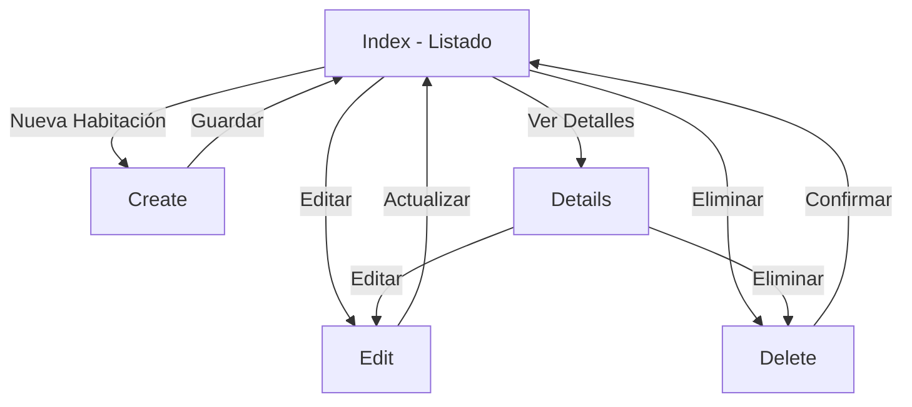

# ?? HotelSuite - Módulo de Habitaciones

## ?? Descripción

Módulo completo de gestión de habitaciones para el sistema HotelSuite, implementado con ASP.NET Core 9, Entity Framework Core, AutoMapper y Bootstrap 5.

## ? Características Implementadas

### ?? Seguridad
- ? Autenticación con `[Authorize]` en el controlador
- ? Protección CSRF con `[ValidateAntiForgeryToken]`
- ? Validación de datos en cliente y servidor

### ?? Funcionalidades de Búsqueda
- ? Búsqueda por tipo de habitación
- ? Búsqueda por estado
- ? Filtros combinables
- ? Paginación con X.PagedList (10 registros por página)
- ? Persistencia de filtros en la paginación

### ?? CRUD Completo
- ? **Index**: Listado con búsqueda y paginación
- ? **Create**: Formulario de creación con validaciones
- ? **Edit**: Formulario de edición
- ? **Details**: Vista detallada de la habitación
- ? **Delete**: Confirmación con múltiples advertencias

### ?? Diseño UI/UX
- ? Bootstrap 5 con diseño responsive
- ? Font Awesome 6 para iconos
- ? Gradientes personalizados temática hotelera
- ? Animaciones CSS suaves
- ? Tarjetas con efectos hover
- ? Badges de estado con colores semánticos
- ? Mensajes de feedback con TempData
- ? Validaciones en español

### ??? Validaciones
- ? DataAnnotations con mensajes en español
- ? Validación de número único por hotel
- ? Rangos de precio
- ? Campos requeridos
- ? Longitud de campos
- ? Validaciones JavaScript personalizadas

## ?? Estructura de Archivos

```
HotelSuite/
??? Controllers/
?   ??? HabitacionesController.cs [Authorize]
?   ??? HotelesController.cs
??? Views/
?   ??? Habitaciones/
?   ?   ??? Index.cshtml (con búsqueda y paginación)
?   ?   ??? Create.cshtml
?   ?   ??? Edit.cshtml
?   ?   ??? Details.cshtml
?   ?   ??? Delete.cshtml
?   ??? Shared/
?       ??? _Layout.cshtml (actualizado)
??? wwwroot/
    ??? css/
     ??? hotel-suite.css (estilos personalizados)

HotelSuite.Application/
??? DTOs/
    ??? HabitacionDTO.cs (con DataAnnotations)
```

## ?? Uso

### Navegación
1. Acceder a la aplicación: `https://localhost:7xxx`
2. Navegar a "Habitaciones" en el menú principal
3. Se requiere autenticación para acceder

### Búsqueda
- **Tipo**: Buscar por tipo de habitación (Suite, Doble, etc.)
- **Estado**: Filtrar por estado (Disponible, Ocupada, etc.)
- Los filtros se pueden combinar
- Botón "Limpiar" para resetear búsqueda

### Crear Habitación
1. Click en "Nueva Habitación"
2. Completar formulario:
   - Número (único por hotel)
   - Tipo (desplegable)
   - Precio (mayor a 0)
   - Estado (desplegable)
   - Hotel (obligatorio)
3. Validaciones en tiempo real
4. Click en "Guardar Habitación"

### Editar Habitación
1. Click en botón de editar (icono lápiz)
2. Modificar campos necesarios
3. Confirmación para cambios críticos de estado
4. Click en "Actualizar Habitación"

### Eliminar Habitación
1. Click en botón eliminar (icono basura)
2. Revisar información
3. Doble confirmación JavaScript
4. Alternativa sugerida: Cambiar estado

## ?? Paleta de Colores

```css
--primary-gradient: linear-gradient(135deg, #667eea 0%, #764ba2 100%);
--success-gradient: linear-gradient(135deg, #11998e 0%, #38ef7d 100%);
--warning-gradient: linear-gradient(135deg, #f093fb 0%, #f5576c 100%);
--info-gradient: linear-gradient(135deg, #4facfe 0%, #00f2fe 100%);
```

## ?? Estados de Habitación

| Estado | Badge | Descripción |
|--------|-------|-------------|
| Disponible |  Verde | Lista para reservar |
| Ocupada |  Rojo | Habitación ocupada |
| Reservada |  Azul | Reservada |
| Mantenimiento |  Amarillo | En mantenimiento |
| Fuera de Servicio |  Gris | No disponible |

## ?? Configuración

### Autenticación
```csharp
// Program.cs
builder.Services.AddAuthentication("CookieAuth")
    .AddCookie("CookieAuth", options =>
    {
        options.LoginPath = "/Account/Login";
    options.AccessDeniedPath = "/Account/AccessDenied";
        options.ExpireTimeSpan = TimeSpan.FromHours(8);
    });
```

### Paginación
```csharp
private const int PageSize = 10; // Registros por página
```

### Cadena de Conexión
```json
{
  "ConnectionStrings": {
    "DefaultConnection": "Server=.;Database=HotelSuiteDb;Trusted_Connection=True;TrustServerCertificate=True;MultipleActiveResultSets=true"
  }
}
```

## ?? Dependencias

### NuGet Packages
- `Microsoft.EntityFrameworkCore` (9.0.10)
- `Microsoft.EntityFrameworkCore.SqlServer` (9.0.10)
- `AutoMapper` (12.0.1)
- `AutoMapper.Extensions.Microsoft.DependencyInjection` (12.0.1)
- `X.PagedList.Mvc.Core` (10.5.9)

### CDN
- Bootstrap 5 (incluido en plantilla)
- Font Awesome 6.4.0
- jQuery (incluido en plantilla)

## ?? Validaciones Implementadas

### Servidor (DataAnnotations)
```csharp
[Required(ErrorMessage = "El número de habitación es obligatorio")]
[StringLength(10, ErrorMessage = "El número no puede exceder los 10 caracteres")]
public string Numero { get; set; }

[Range(0.01, 999999.99, ErrorMessage = "El precio debe estar entre 0.01 y 999,999.99")]
public decimal PrecioPorNoche { get; set; }
```

### Cliente (JavaScript)
- Formateo automático de precios
- Validación de precio mayor a cero
- Confirmaciones antes de eliminar
- Alertas para cambios críticos de estado

## ?? Responsive Design

- ? Móviles (< 768px): Diseño compacto, botones pequeños
- ? Tablets (768px - 1024px): Diseño optimizado
- ? Desktop (> 1024px): Diseño completo con todas las funcionalidades

## ?? Flujo de Trabajo



## ?? Mensajes de Error Comunes

| Error | Causa | Solución |
|-------|-------|----------|
| "Ya existe una habitación con este número" | Número duplicado en hotel | Usar otro número |
| "El precio debe ser mayor a cero" | Precio inválido | Ingresar precio válido |
| "Debe seleccionar un hotel" | Hotel no seleccionado | Seleccionar hotel del dropdown |
| "Error al eliminar... tiene reservas asociadas" | Relaciones FK | Eliminar reservas primero o cambiar estado |

## ?? Mejoras Futuras

- [ ] Carga de imágenes de habitaciones
- [ ] Vista de galería con imágenes
- [ ] Exportar a PDF/Excel
- [ ] Gráficos de ocupación
- [ ] Calendario de disponibilidad
- [ ] Reservas directas desde la vista
- [ ] Historial de cambios
- [ ] Comparador de habitaciones

## ????? Ejemplo de Uso en Código

```csharp
// Obtener habitaciones con filtro
var habitaciones = await _unitOfWork.Habitaciones.GetAllAsync();
var habitacionesFiltradas = habitaciones
    .Where(h => h.Estado == "Disponible")
    .OrderBy(h => h.Numero);

// Convertir a DTO
var habitacionesDTO = _mapper.Map<IEnumerable<HabitacionDTO>>(habitacionesFiltradas);

// Aplicar paginación
var habitacionesPaginadas = habitacionesDTO.ToPagedList(pagina, PageSize);
```

## ?? Notas de Desarrollo

1. **Autorización**: Implementar atributos específicos de roles cuando sea necesario
2. **Validaciones**: Las validaciones del servidor son obligatorias; las del cliente mejoran UX
3. **Mensajes**: Usar siempre TempData para feedback al usuario
4. **DTOs**: Nunca exponer entidades del dominio directamente en las vistas
5. **Transacciones**: CommitAsync maneja rollback automático en errores

## ?? Solución de Problemas

### La paginación no funciona
- Verificar que X.PagedList.Mvc.Core esté instalado
- Comprobar los using en la vista Index
- Revisar que el CSS de PagedList esté cargado

### Los iconos no aparecen
- Verificar la conexión a CDN de Font Awesome
- Comprobar el navegador (F12) para errores de carga
- Verificar que el link esté en el `<head>` del layout

### Las validaciones no funcionan
- Verificar que _ValidationScriptsPartial esté incluido
- Comprobar que jQuery esté cargado antes
- Revisar la consola del navegador para errores JS

## ?? Soporte

Para problemas o sugerencias, revisar:
- Logs de la aplicación
- Consola del navegador (F12)
- Documentación de Entity Framework Core
- Documentación de AutoMapper

---

**Versión**: 1.0.0  
**Última actualización**: 2025  
**Tecnologías**: ASP.NET Core 9, EF Core 9, Bootstrap 5, AutoMapper 12
