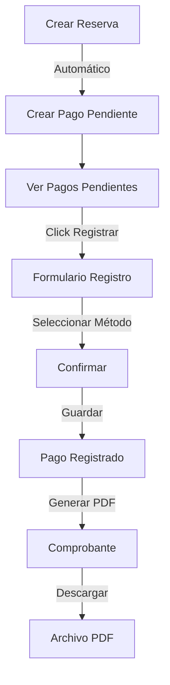

# ?? HotelSuite - Módulo de Pagos

## ?? Descripción

Módulo completo de gestión de pagos con funcionalidades de registro, listado y generación de comprobantes en PDF utilizando QuestPDF.

## ? Características Implementadas

### ?? Funcionalidades Principales

#### 1. **Listar Pagos** (Index)
- ? Listado paginado de todos los pagos
- ? Filtros por estado (Pendientes/Pagados)
- ? Información resumida de cada pago
- ? Badges de estado con colores semánticos
- ? Acciones contextuales (Ver, Registrar, Generar PDF)

#### 2. **Pagos Pendientes** (Pendientes)
- ? Vista especializada para pagos pendientes
- ? Resumen estadístico:
  - Total de pagos pendientes
  - Monto total pendiente
  - Fecha actual
- ? Acceso rápido para registrar pagos
- ? Estado visual con tabla en amarillo

#### 3. **Registrar Pago** (Registrar)
- ? Formulario para registrar método de pago
- ? Resumen de la reserva asociada
- ? Resumen financiero calculado
- ? Selector de métodos de pago:
  - Efectivo
  - Tarjeta de Crédito
  - Tarjeta de Débito
  - Transferencia Bancaria
  - PayPal
  - Cheque
- ? Información contextual por método
- ? Validaciones y confirmaciones
- ? Actualización automática de fecha de pago

#### 4. **Generar Comprobante PDF** ?
- ? Generación de PDF profesional con QuestPDF
- ? Diseño hotelero elegante
- ? Información completa:
  - Datos del hotel (encabezado)
  - Folio único
  - Información del huésped
  - Detalles de la reserva
  - Desglose de pagos (tabla)
  - Información del pago
- Total destacado
  - Notas legales
  - Espacios para firmas
- ? Descarga directa del PDF
- ? Vista previa en navegador (target="_blank")

### ?? Estados de Pago

| Estado | Badge | Descripción |
|--------|-------|-------------|
| Pendiente |  Amarillo | Pago no registrado |
| Efectivo |  Verde | Pago en efectivo |
| Tarjeta |  Azul | Pago con tarjeta |
| Transferencia |  Cyan | Transferencia bancaria |

## ??? Arquitectura

### Controlador: PagosController

```csharp
public class PagosController : Controller
{
    private readonly IUnitOfWork _unitOfWork;
    private readonly IMapper _mapper;
    private readonly ComprobanteService _comprobanteService;

    // Métodos principales:
    - Index() - Listar todos los pagos con filtros
    - Pendientes() - Listar solo pagos pendientes
    - Details(id) - Detalles del pago
    - Registrar(id) GET - Formulario de registro
    - Registrar(id) POST - Procesar registro
    - GenerarComprobante(id) - Generar PDF
}
```

### Servicio: ComprobanteService

```csharp
public class ComprobanteService
{
    public byte[] GenerarComprobantePDF(
        PagoDTO pago, 
        ReservaDTO reserva, 
        HuespedDTO huesped, 
        HabitacionDTO habitacion)
    {
        // Genera PDF profesional con QuestPDF
        // Retorna byte[] para descarga
    }
}
```

## ?? Dependencias

### NuGet Packages
- **QuestPDF** (2025.7.3) - Generación de PDF
  - Licencia: Community (gratis para uso no comercial)
  - Características:
    - API fluida y fácil de usar
    - Soporte completo para tablas
  - Estilos y colores personalizables
    - Paginación automática

## ?? Diseño del Comprobante PDF

### Estructura del PDF

```
???????????????????????????????????????????????
? HOTELSUITE          COMPROBANTE DE PAGO     ?
? Sistema Gestión     Folio: 20250115-1234    ?
? RFC: HOTEL123...    Fecha: 15/01/2025       ?
???????????????????????????????????????????????
?           ?
? INFORMACIÓN DEL HUÉSPED          ?
? • Nombre, Email, Teléfono, Documento     ?
?      ?
? DETALLES DE LA RESERVA          ?
? • ID, Check-in, Check-out, Habitación       ?
?        ?
? DESGLOSE DE PAGOS     ?
? ??????????????????????????????????????      ?
? ? Concepto?Precio/Noche?Noches?Total?      ?
? ??????????????????????????????????????      ?
? ? Suite   ? $150.00    ?  3   ?$450?      ?
? ??????????????????????????????????????  ?
?   ?
? INFORMACIÓN DEL PAGO?
? • Método, Fecha, ID ?
?            ?
???????????????????????           ?
?       ? TOTAL PAGADO       ?        ?
?             ? $450.00            ?           ?
?         ??????????????????????           ?
?    ?
? NOTAS IMPORTANTES   ?
? • Este comprobante es válido...        ?
?     ?
? _____________      _____________     ?
? Firma Cliente      Firma Autorizada          ?
???????????????????????????????????????????????
```

### Estilos del PDF

```csharp
// Colores principales
- Azul (Primary): #667eea - #764ba2
- Verde (Success): #11998e - #38ef7d
- Gris (Info): #f5f5f5

// Tipografía
- Fuente: Arial
- Tamaños: 11pt (normal), 14-24pt (títulos)

// Espaciado
- Márgenes: 2cm
- Padding interno: 10-20px
- Separadores con líneas horizontales
```

## ?? Flujo del Proceso

### 1. Flujo Normal



### 2. Flujo de Generación de PDF

```csharp
Usuario ? Click "Generar Comprobante" 
    ?
Controlador obtiene datos:
    • Pago
    • Reserva
    • Huésped
    • Habitación
    ?
ComprobanteService.GenerarComprobantePDF()
    ?
QuestPDF genera documento:
    • Encabezado con logo
    • Información completa
    • Desglose detallado
    • Total destacado
    • Notas legales
    ?
Retorna byte[]
    ?
Controller retorna File(bytes, "application/pdf", nombre)
 ?
Navegador descarga/muestra PDF
```

## ?? Código del Servicio PDF

### Ejemplo Simplificado

```csharp
public byte[] GenerarComprobantePDF(...)
{
    QuestPDF.Settings.License = LicenseType.Community;

 var document = Document.Create(container =>
    {
  container.Page(page =>
        {
  page.Size(PageSizes.A4);
     page.Margin(2, Unit.Centimetre);
            
       // Encabezado
         page.Header().Element(ComposeHeader);
    
    // Contenido
            page.Content().Element(content => 
     ComposeContent(content, pago, reserva, huesped, habitacion));
            
    // Pie de página
 page.Footer().AlignCenter().Text("Página 1");
        });
    });

    return document.GeneratePdf();
}
```

## ?? Vistas Implementadas

### 1. **Index.cshtml**
```razor
Características:
- Tabla paginada con X.PagedList
- Filtros por estado (Todos/Pendientes/Pagados)
- Badges de estado con colores
- Botones de acción:
  * Ver Detalles
  * Registrar Pago (si pendiente)
  * Generar PDF (si pagado)
```

### 2. **Pendientes.cshtml**
```razor
Características:
- Cards de resumen:
  * Total pendientes
  * Monto total pendiente
  * Fecha actual
- Tabla destacada en amarillo
- Botón directo "Pagar"
- Mensaje si no hay pendientes
```

### 3. **Details.cshtml**
```razor
Características:
- Cards informativas:
  * Información del pago
  * Detalles de la reserva
  * Datos del huésped
  * Información de la habitación
- Botones de acción:
  * Registrar pago (si pendiente)
  * Generar PDF (si pagado)
  * Descargar PDF
```

### 4. **Registrar.cshtml**
```razor
Características:
- Resumen de la reserva
- Resumen financiero destacado
- Selector de método de pago
- Información contextual por método
- Validaciones JavaScript
- Confirmación antes de enviar
- Recordatorios importantes
```

## ?? Ejemplos de Uso

### 1. Registrar un Pago

```
Usuario navega a: /Pagos/Pendientes

1. Ve el listado de pagos pendientes
2. Click en "Pagar" en la fila del pago
3. Revisa el resumen de la reserva
4. Selecciona método de pago (ej: "Efectivo")
5. Aparece información: "Recuerde entregar el cambio..."
6. Click en "Registrar Pago"
7. Confirma en el popup
8. Sistema actualiza el pago
9. Redirect a Details
10. Ahora puede generar el comprobante
```

### 2. Generar Comprobante PDF

```
Usuario en: /Pagos/Details/5

1. Verifica que el pago está registrado
2. Click en "Generar Comprobante PDF"
3. Sistema obtiene todos los datos necesarios
4. ComprobanteService genera el PDF
5. Navegador muestra/descarga el PDF
6. Usuario guarda el archivo:
   "Comprobante_Pago_5_20250115.pdf"
```

## ?? Validaciones

### Servidor
```csharp
// Registrar pago
- Método no puede ser "Pendiente"
- ID debe coincidir
- Pago debe existir
- Reserva debe estar asociada

// Generar PDF
- Pago no puede estar pendiente
- Deben existir todos los datos relacionados
- Reserva, huésped y habitación válidos
```

### Cliente (JavaScript)
```javascript
// Formulario de registro
- Método de pago seleccionado
- Botón habilitado solo si hay método
- Información contextual por método
- Confirmación antes de enviar
- Mostrar monto y método en confirmación
```

## ?? Métodos de Pago Soportados

```csharp
var metodosPago = new List<SelectListItem>
{
    new { Value = "Efectivo", Text = "Efectivo" },
    new { Value = "Tarjeta de Crédito", Text = "Tarjeta de Crédito" },
    new { Value = "Tarjeta de Débito", Text = "Tarjeta de Débito" },
    new { Value = "Transferencia Bancaria", Text = "Transferencia Bancaria" },
    new { Value = "PayPal", Text = "PayPal" },
    new { Value = "Cheque", Text = "Cheque" }
};
```

### Información Contextual

| Método | Descripción |
|--------|-------------|
| Efectivo | "Recuerde entregar el cambio si es necesario y contar el dinero." |
| Tarjeta de Crédito | "Verifique que la transacción fue aprobada." |
| Tarjeta de Débito | "Confirme que el cargo fue realizado." |
| Transferencia | "Verifique que los fondos fueron recibidos en la cuenta." |
| PayPal | "Confirme la transacción en el sistema." |
| Cheque | "Verifique los datos del cheque y guárdelo hasta que se haga efectivo." |

## ?? Diseño UI/UX

### Colores y Gradientes

```css
/* Pagos */
--pago-gradient: linear-gradient(135deg, #11998e 0%, #38ef7d 100%);
--pendiente-gradient: linear-gradient(135deg, #f093fb 0%, #f5576c 100%);

/* Badges */
.badge-pendiente { background: #ffc107; }
.badge-efectivo { background: #28a745; }
.badge-tarjeta { background: #0d6efd; }
.badge-transferencia { background: #17a2b8; }
```

### Iconos Font Awesome

- Pagos: `fa-dollar-sign`
- Pendiente: `fa-clock`
- Registrar: `fa-check-circle`
- PDF: `fa-file-pdf`
- Descargar: `fa-download`
- Método: `fa-credit-card`
- Monto: `fa-receipt`

## ?? Manejo de Errores

### Errores Comunes

| Error | Causa | Solución |
|-------|-------|----------|
| "No se puede generar comprobante de un pago pendiente" | Pago no registrado | Registrar el pago primero |
| "No se encontró un pago pendiente para esta reserva" | Ya fue registrado | Ver en listado de pagos |
| "Faltan datos para generar el comprobante" | Datos incompletos | Verificar reserva completa |
| "Debe seleccionar un método de pago válido" | Método = "Pendiente" | Seleccionar método real |

## ?? Características del PDF

### Encabezado
- Logo/Nombre del hotel
- RFC y datos de contacto
- Folio único generado
- Fecha y hora de generación

### Información del Huésped
- Nombre completo
- Email y teléfono
- Documento de identidad

### Detalles de la Reserva
- ID de reserva
- Fechas de check-in y check-out
- Habitación y tipo
- Número de noches

### Desglose Financiero
- Tabla con:
  * Concepto (tipo de habitación)
  * Precio por noche
  * Cantidad de noches
  * Subtotal
- Total destacado en grande

### Información del Pago
- Método de pago utilizado
- Fecha y hora del pago
- ID del pago

### Notas Legales
- Validez del comprobante
- Instrucciones de conservación
- Datos de contacto
- Políticas de devolución

### Firmas
- Espacio para firma del cliente
- Espacio para firma autorizada

## ?? Responsive Design

- ? Diseño adaptable para móviles
- ? Tablas con scroll horizontal
- ? Cards apilables en pantallas pequeñas
- ? Botones de tamaño apropiado
- ? PDF optimizado para A4

## ?? Integración con Otros Módulos

### Con Reservas
```csharp
// Al crear reserva ? crear pago pendiente
var pago = new Pago
{
    Monto = montoTotal,
    FechaPago = DateTime.Now,
    Metodo = "Pendiente",
    IdReserva = reserva.Id
};
await _unitOfWork.Pagos.AddAsync(pago);
```

### Con Habitaciones
```csharp
// Obtener precio para calcular monto
var habitacion = await _unitOfWork.Habitaciones.GetByIdAsync(reserva.IdHabitacion);
var montoTotal = habitacion.PrecioPorNoche * reserva.DiasEstancia;
```

### Con Huéspedes
```csharp
// Obtener datos para comprobante
var huesped = await _unitOfWork.Huespedes.GetByIdAsync(reserva.IdHuesped);
// Usar en PDF: nombre, email, teléfono, documento
```

## ?? Mejoras Futuras

- [ ] Envío de comprobante por email
- [ ] Múltiples métodos de pago en una reserva
- [ ] Pagos parciales
- [ ] Descuentos y promociones
- [ ] Integración con pasarelas de pago
- [ ] Historial de pagos por huésped
- [ ] Reportes de ingresos
- [ ] Exportar a Excel
- [ ] Gráficos de pagos por mes
- [ ] Alertas de pagos vencidos

## ?? Estadísticas del Sistema

Al registrar un pago:
```
1 UPDATE en Pagos (cambiar método y fecha)
1 consulta en Reservas (obtener datos)
1 consulta en Habitaciones (obtener precio)
1 consulta en Huespedes (obtener datos)
Total: 4 operaciones de base de datos
```

Al generar PDF:
```
4 consultas (Pago, Reserva, Habitación, Huésped)
1 generación de PDF (en memoria)
1 descarga (bytes ? archivo)
Total: ~1-2 segundos para generar PDF completo
```

---

**Versión**: 1.0.0  
**Última actualización**: 2025  
**Autor**: Sistema HotelSuite  
**Tecnologías**: ASP.NET Core 9, EF Core 9, QuestPDF 2025.7, Bootstrap 5, jQuery, AutoMapper 12
