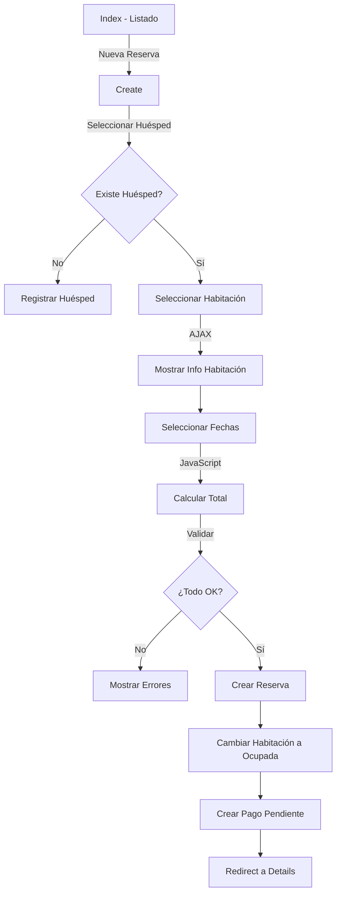

# ?? HotelSuite - Módulo de Reservas

## ?? Descripción

Módulo completo de gestión de reservas implementado con el patrón de caso de uso "Registrar Reserva", incluyendo validaciones automáticas, cálculos dinámicos y generación de pagos pendientes.

## ? Características Implementadas

### ?? Caso de Uso: Registrar Reserva

#### **Acción Create (GET)**
- ? Formulario con selectores dinámicos
- ? Lista de huéspedes registrados
- ? Lista de habitaciones con estado "Disponible" únicamente
- ? Valores por defecto: fecha de entrada (mañana), fecha de salida (pasado mañana)
- ? Información completa de la habitación seleccionada via AJAX

#### **Acción Create (POST)**
- ? Validación de disponibilidad de habitación
- ? Validación de fechas (no anterior a hoy, salida posterior a entrada)
- ? Validación de reservas superpuestas
- ? Cálculo automático: noches × precio habitación
- ? Registro de reserva con estado "Confirmada"
- ? Cambio automático de habitación a estado "Ocupada"
- ? **Creación automática de Pago pendiente** con el monto total

### ?? Validaciones Implementadas

#### **Servidor (ModelState)**
```csharp
// Fechas
- Fecha de entrada no puede ser anterior a hoy
- Fecha de salida debe ser posterior a fecha de entrada

// Disponibilidad
- Habitación debe existir
- Habitación debe estar en estado "Disponible"
- No debe haber reservas superpuestas para las mismas fechas

// Datos Requeridos
- Huésped obligatorio
- Habitación obligatoria
- Fechas obligatorias
```

#### **Cliente (JavaScript)**
```javascript
// Validaciones en tiempo real
- Cálculo automático de noches
- Cálculo automático de precio total
- Actualización dinámica del resumen
- Habilitación/deshabilitación del botón guardar
- Confirmación antes de enviar
- Validación de fechas mínimas
```

### ?? Cálculos Automáticos

```
Total Noches = Fecha Salida - Fecha Entrada
Subtotal = Precio Habitación × Total Noches
Total a Pagar = Subtotal
```

### ?? Entidades Afectadas

1. **Reserva** (nueva)
   - FechaReserva: DateTime.Now
   - Estado: "Confirmada"
   - IdHuesped, IdHabitacion
   - FechaEntrada, FechaSalida

2. **Habitacion** (actualizada)
   - Estado: cambia de "Disponible" ? "Ocupada"

3. **Pago** (nuevo automáticamente)
   - Monto: Total calculado
   - FechaPago: DateTime.Now
   - Metodo: "Pendiente"
   - IdReserva: ID de la reserva creada

## ?? Vistas Implementadas

### 1. **Create.cshtml** (Principal)
**Características:**
- Diseño con Bootstrap 5
- Selectores dinámicos (Huésped, Habitación)
- Inputs de fecha con validación HTML5
- Tarjeta de información de habitación (AJAX)
- Resumen financiero en tiempo real:
  - Noches
  - Precio/Noche
  - Subtotal
  - Total a Pagar
- Validaciones JavaScript
- Botón de guardar habilitado condicionalmente

**Secciones:**
1. Información del Huésped
2. Información de la Habitación
3. Fechas de la Reserva
4. Resumen de Estancia (calculado en tiempo real)
5. Información Importante

### 2. **Index.cshtml**
- Listado paginado de reservas
- Búsqueda por estado
- Badges de estado con colores semánticos
- Botones de acción (Ver, Editar, Cancelar)
- Información resumida (Check-in, Check-out, Noches)

### 3. **Details.cshtml**
- Vista detallada de la reserva
- Información del huésped
- Información de la habitación
- Fechas de reserva
- Resumen financiero completo
- Botones de acción contextuales

### 4. **Edit.cshtml**
- Formulario de edición
- Permite cambiar huésped, habitación, fechas y estado
- Advertencias al cambiar a estado "Cancelada"
- Validaciones similares a Create

### 5. **Cancel.cshtml**
- Vista de confirmación de cancelación
- Muestra toda la información de la reserva
- Lista de consecuencias de la cancelación
- Doble confirmación JavaScript
- Sugiere editar como alternativa

## ?? Flujo del Proceso



## ?? Estados de Reserva

| Estado | Badge | Descripción |
|--------|-------|-------------|
| Confirmada |  Verde | Reserva confirmada |
| Pendiente |  Amarillo | En espera |
| Completada |  Azul | Check-out realizado |
| Cancelada |  Rojo | Reserva cancelada |

## ?? Código del Controlador

### Método Create (POST) - Simplificado

```csharp
[HttpPost]
[ValidateAntiForgeryToken]
public async Task<IActionResult> Create(ReservaDTO reservaDTO)
{
    // 1. Validar ModelState
    if (!ModelState.IsValid) return View(reservaDTO);

 // 2. Validar fechas
    if (reservaDTO.FechaEntrada < DateTime.Now.Date)
        ModelState.AddModelError("FechaEntrada", "...");

    // 3. Validar disponibilidad de habitación
  var habitacion = await _unitOfWork.Habitaciones.GetByIdAsync(reservaDTO.IdHabitacion);
    if (habitacion.Estado != "Disponible")
   ModelState.AddModelError("IdHabitacion", "...");

    // 4. Validar reservas superpuestas
    var reservasSuperpuestas = await ValidarReservasSuperpuestas(...);
    if (reservasSuperpuestas.Any())
        ModelState.AddModelError("IdHabitacion", "...");

    // 5. Calcular monto total
    var diasEstancia = (reservaDTO.FechaSalida - reservaDTO.FechaEntrada).Days;
    var montoTotal = habitacion.PrecioPorNoche * diasEstancia;

    // 6. Crear reserva
    var reserva = _mapper.Map<Reserva>(reservaDTO);
    await _unitOfWork.Reservas.AddAsync(reserva);
    await _unitOfWork.CommitAsync();

    // 7. Cambiar estado de habitación
    habitacion.Estado = "Ocupada";
    _unitOfWork.Habitaciones.Update(habitacion);
    await _unitOfWork.CommitAsync();

    // 8. Crear pago pendiente
    var pago = new Pago
 {
        Monto = montoTotal,
        Metodo = "Pendiente",
        IdReserva = reserva.Id
    };
    await _unitOfWork.Pagos.AddAsync(pago);
    await _unitOfWork.CommitAsync();

    return RedirectToAction(nameof(Details), new { id = reserva.Id });
}
```

## ?? JavaScript en Create.cshtml

### Funciones Principales

```javascript
// 1. Obtener información de habitación via AJAX
$('#selectHabitacion').change(function() {
    $.ajax({
        url: '@Url.Action("GetHabitacionInfo", "Reservas")',
        data: { id: habitacionId },
        success: function(response) {
            // Actualizar UI con información
        }
 });
});

// 2. Calcular total automáticamente
function calcularTotal() {
    var diffDays = calcularDiferenciaDias();
    var total = precioHabitacion * diffDays;
    actualizarResumen(diffDays, total);
    validarFormulario();
}

// 3. Validar formulario completo
function validarFormulario() {
    if (todosLosCamposCompletos()) {
   $('#btnGuardar').prop('disabled', false);
    }
}

// 4. Confirmación antes de enviar
$('#formReserva').submit(function(e) {
  if (!confirm('¿Confirma crear la reserva?')) {
        e.preventDefault();
    }
});
```

## ?? Endpoint AJAX

```csharp
[HttpGet]
public async Task<IActionResult> GetHabitacionInfo(int id)
{
    var habitacion = await _unitOfWork.Habitaciones.GetByIdAsync(id);
    
    return Json(new 
    { 
        success = true,
   numero = habitacion.Numero,
 tipo = habitacion.Tipo,
      precio = habitacion.PrecioPorNoche,
      estado = habitacion.Estado
    });
}
```

## ?? Casos de Uso Adicionales

### Cancelar Reserva
```csharp
public async Task<IActionResult> CancelConfirmed(int id)
{
    // 1. Cambiar estado reserva a "Cancelada"
    reserva.Estado = "Cancelada";
    
    // 2. Cambiar estado habitación a "Disponible"
    habitacion.Estado = "Disponible";
    
    // 3. Guardar cambios (mantener pagos para historial)
    await _unitOfWork.CommitAsync();
}
```

## ?? Ejemplo de Uso

### 1. Crear Nueva Reserva

```
Usuario navega a: /Reservas/Create

Pasos:
1. Selecciona un huésped del dropdown
2. Selecciona una habitación disponible
   - Se muestra automáticamente: Número, Tipo, Precio, Estado
3. Selecciona fecha de entrada (ej: 15/01/2025)
4. Selecciona fecha de salida (ej: 18/01/2025)
5. El sistema calcula:
   - Noches: 3
   - Precio/Noche: $150.00
   - Total: $450.00
6. Click en "Crear Reserva"
7. Confirmación: "¿Confirma crear la reserva? Total: $450.00, Noches: 3"
8. Sistema crea:
   - Reserva con estado "Confirmada"
   - Cambia habitación a "Ocupada"
   - Crea pago pendiente por $450.00
9. Redirect a Details de la reserva
```

## ?? DTOs Actualizados

### ReservaDTO
```csharp
public class ReservaDTO
{
    public int Id { get; set; }
    
    [Required(ErrorMessage = "La fecha de reserva es obligatoria")]
    public DateTime FechaReserva { get; set; }
    
    [Required(ErrorMessage = "La fecha de entrada es obligatoria")]
    public DateTime FechaEntrada { get; set; }
    
    [Required(ErrorMessage = "La fecha de salida es obligatoria")]
    public DateTime FechaSalida { get; set; }
    
    [Required(ErrorMessage = "El estado es obligatorio")]
public string Estado { get; set; }
    
    [Required(ErrorMessage = "Debe seleccionar un huésped")]
    public int IdHuesped { get; set; }
    
    [Required(ErrorMessage = "Debe seleccionar una habitación")]
    public int IdHabitacion { get; set; }
    
    // Propiedades calculadas
    public decimal? PrecioHabitacion { get; set; }
    public decimal? MontoTotal { get; set; }
    public int DiasEstancia => (FechaSalida - FechaEntrada).Days;
}
```

## ?? Seguridad

- ? `[Authorize]` en el controlador
- ? `[ValidateAntiForgeryToken]` en POST
- ? Validaciones de disponibilidad
- ? Validaciones de fechas
- ? Validaciones de reservas superpuestas
- ? Try-catch en todas las acciones
- ? Mensajes de error informativos

## ?? Diseño UI/UX

### Colores y Badges
```css
Confirmada: Verde (#28a745)
Pendiente: Amarillo (#ffc107)
Completada: Azul (#0d6efd)
Cancelada: Rojo (#dc3545)
```

### Iconos Font Awesome
- Reserva: `fa-calendar-check`
- Huésped: `fa-user`
- Habitación: `fa-door-open` / `fa-bed`
- Fechas: `fa-calendar`
- Dinero: `fa-dollar-sign`
- Noches: `fa-moon`

## ?? Responsive

- ? Diseño mobile-first
- ? Cards adaptables
- ? Tabla responsive
- ? Botones apilados en móviles

## ?? Manejo de Errores

### Errores Comunes

| Error | Causa | Solución |
|-------|-------|----------|
| "La habitación no está disponible" | Estado != "Disponible" | Seleccionar otra habitación |
| "Ya hay reservas para estas fechas" | Reservas superpuestas | Cambiar fechas o habitación |
| "Fecha de entrada anterior a hoy" | Fecha inválida | Seleccionar fecha futura |
| "Fecha de salida debe ser posterior" | Fechas incorrectas | Ajustar fechas |

## ?? Mejoras Futuras

- [ ] Calendario visual de disponibilidad
- [ ] Múltiples habitaciones en una reserva
- [ ] Servicios adicionales (desayuno, spa, etc.)
- [ ] Descuentos por estancia prolongada
- [ ] Integración con sistemas de pago
- [ ] Notificaciones por email
- [ ] Check-in/Check-out desde la app
- [ ] Historial de reservas del huésped

## ?? Métricas del Sistema

Al crear una reserva:
```
1 INSERT en Reservas
1 UPDATE en Habitaciones
1 INSERT en Pagos
3 transacciones totales (con CommitAsync)
```

## ?? Transaccionalidad

```csharp
// UnitOfWork maneja transacciones automáticamente
try {
    await _unitOfWork.Reservas.AddAsync(reserva);
    await _unitOfWork.CommitAsync(); // Transacción 1
    
    _unitOfWork.Habitaciones.Update(habitacion);
    await _unitOfWork.CommitAsync(); // Transacción 2
    
    await _unitOfWork.Pagos.AddAsync(pago);
    await _unitOfWork.CommitAsync(); // Transacción 3
}
catch {
    // Rollback automático
}
```

---

**Versión**: 1.0.0  
**Última actualización**: 2025  
**Autor**: Sistema HotelSuite  
**Tecnologías**: ASP.NET Core 9, EF Core 9, jQuery, Bootstrap 5, AutoMapper 12
