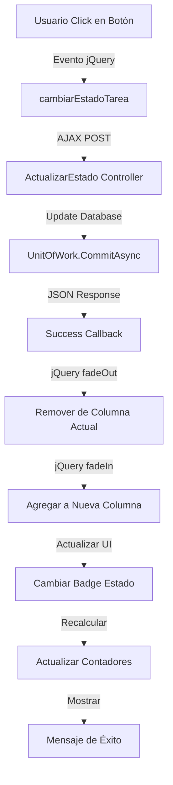

# ?? HotelSuite - Módulo de Gestión de Tareas por Departamento

## ?? Descripción

Módulo completo de gestión de departamentos y tareas con tablero Kanban y actualización en tiempo real mediante AJAX.

## ? Características Implementadas

### ?? Funcionalidades Principales

#### 1. **CRUD de Departamentos** ?
**DepartamentosController:**
- ? Index - Listado con búsqueda y paginación
- ? Create - Crear nuevos departamentos
- ? Edit - Editar departamentos existentes
- ? Details - Ver detalles con estadísticas
- ? Delete - Eliminar con validaciones

**Departamentos Predefinidos:**
- Limpieza (ícono: broom, color: verde)
- Mantenimiento (ícono: tools, color: amarillo)
- Recepción (ícono: concierge-bell, color: azul)

#### 2. **Gestión de Tareas** ?
**TareasDepartamentoController:**
- ? Index - Listado con filtros por departamento y estado
- ? **TableroTareas** - Vista Kanban en tiempo real
- ? Create - Crear nuevas tareas
- ? Edit - Editar tareas existentes
- ? Details - Ver detalles completos
- ? Delete - Eliminar tareas
- ? **ActualizarEstado** (AJAX) - Actualizar estado sin recargar
- ? ObtenerTarea (AJAX) - Obtener información de tarea

#### 3. **Estados de Tareas** ??
```
??????????????????????????????????????????????
?  Pendiente   ?  En Proceso  ?  Completada  ?
?  (Amarillo)  ?    (Azul)    ?   (Verde)    ?
??????????????????????????????????????????????
```

**Estados Disponibles:**
| Estado | Color | Ícono | Descripción |
|--------|-------|-------|-------------|
| Pendiente | Amarillo | clock | Tarea sin iniciar |
| En proceso | Azul | spinner | Tarea en curso |
| Completada | Verde | check-circle | Tarea finalizada |

#### 4. **Prioridades de Tareas** ?
| Prioridad | Color | Badge |
|-----------|-------|-------|
| Alta | Rojo | danger |
| Media | Amarillo | warning |
| Baja | Verde | success |

#### 5. **Tablero Kanban con AJAX** ? (FEATURE PRINCIPAL)

**Características del Tablero:**
- ? **Vista tipo Kanban** con 3 columnas (Pendiente, En Proceso, Completada)
- ? **Actualización en tiempo real** mediante AJAX (sin recargar página)
- ? **Transiciones suaves** con animaciones CSS y jQuery
- ? **Botones de acción contextual** según el estado:
  - Pendiente ? "Iniciar" (cambia a En Proceso)
  - En Proceso ? "Pausar" (vuelve a Pendiente) | "Completar" (cambia a Completada)
  - Completada ? "Reabrir" (vuelve a En Proceso)
- ? **Contadores en tiempo real** que se actualizan automáticamente
- ? **Filtro por departamento** con recarga inteligente
- ? **Modal de detalles** con carga AJAX
- ? **Scroll independiente** por columna

## ??? Arquitectura

### Controladores

#### **DepartamentosController**
```csharp
public class DepartamentosController : Controller
{
    // GET: Departamentos
    Index(string? busqueda, int? pagina)
    
  // GET: Departamentos/Create
    Create()
    
    // POST: Departamentos/Create
    [HttpPost] Create(DepartamentoDTO departamentoDTO)
    
  // GET: Departamentos/Edit/5
    Edit(int id)
    
    // POST: Departamentos/Edit/5
    [HttpPost] Edit(int id, DepartamentoDTO departamentoDTO)
    
    // GET: Departamentos/Details/5
    Details(int id) // Con estadísticas de empleados y tareas
    
    // GET/POST: Departamentos/Delete/5
    Delete(int id) // Con validaciones
}
```

#### **TareasDepartamentoController**
```csharp
public class TareasDepartamentoController : Controller
{
    // Vista Kanban con AJAX
    TableroTareas(int? idDepartamento)
    
    // Endpoints AJAX
    [HttpPost] ActualizarEstado([FromBody] ActualizarEstadoRequest request)
    [HttpGet] ObtenerTarea(int id)
    
    // CRUD tradicional
    Index, Create, Edit, Details, Delete
}
```

### Modelos de Datos

#### **TareaDepartamento** (Entidad)
```csharp
public class TareaDepartamento
{
    public int Id { get; set; }
    public string Titulo { get; set; }
    public string? Descripcion { get; set; }
    public string Estado { get; set; } = "Pendiente";
    public string Prioridad { get; set; } = "Media";
    public DateTime FechaAsignacion { get; set; }
    public DateTime? FechaFinalizacion { get; set; }
    public int IdDepartamento { get; set; }
    public int? IdEmpleadoAsignado { get; set; }
    
    // Relaciones
    public Departamento Departamento { get; set; }
 public Empleado? Empleado { get; set; }
}
```

#### **TareaDepartamentoDTO**
```csharp
public class TareaDepartamentoDTO
{
    [Required] public string Titulo { get; set; }
    public string? Descripcion { get; set; }
    [Required] public string Estado { get; set; }
    [Required] public string Prioridad { get; set; }
    public DateTime FechaAsignacion { get; set; }
    public DateTime? FechaFinalizacion { get; set; }
    [Required] public int IdDepartamento { get; set; }
    public int? IdEmpleadoAsignado { get; set; }
    
    // Propiedades de navegación
    public string? NombreDepartamento { get; set; }
    public string? NombreEmpleado { get; set; }
}
```

## ?? Vista TableroTareas - Detalles Técnicos

### HTML Structure
```html
<div class="row g-3">
    <!-- Columna Pendientes -->
    <div class="col-md-4">
<div class="card">
     <div class="card-header bg-warning">Pendientes</div>
  <div class="card-body" id="columnaPendientes">
        <!-- Tarjetas de tareas -->
       </div>
        </div>
    </div>
    
    <!-- Columna En Proceso -->
    <div class="col-md-4">
    <div class="card">
     <div class="card-header bg-info">En Proceso</div>
            <div class="card-body" id="columnaEnProceso">
            <!-- Tarjetas de tareas -->
      </div>
        </div>
    </div>
    
    <!-- Columna Completadas -->
    <div class="col-md-4">
        <div class="card">
       <div class="card-header bg-success">Completadas</div>
            <div class="card-body" id="columnaCompletadas">
          <!-- Tarjetas de tareas -->
            </div>
        </div>
    </div>
</div>
```

### JavaScript - AJAX en Tiempo Real

#### 1. **Cambiar Estado de Tarea**
```javascript
function cambiarEstadoTarea(id, nuevoEstado) {
    $.ajax({
        url: '@Url.Action("ActualizarEstado", "TareasDepartamento")',
    type: 'POST',
     contentType: 'application/json',
        data: JSON.stringify({ id: id, nuevoEstado: nuevoEstado }),
        success: function(response) {
            if (response.success) {
       mostrarMensaje('success', response.message);
    
          // Mover la tarjeta a la columna correspondiente
   moverTarjeta(id, nuevoEstado);
     
    // Actualizar contadores
       actualizarContadores();
            }
        }
    });
}
```

#### 2. **Mover Tarjeta Entre Columnas**
```javascript
function moverTarjeta(id, nuevoEstado) {
    var $tarjeta = $(`.tarea-card[data-id="${id}"]`);
    var columnaDestino;

    switch(nuevoEstado) {
        case 'Pendiente':
            columnaDestino = '#columnaPendientes';
    break;
     case 'En proceso':
  columnaDestino = '#columnaEnProceso';
  break;
        case 'Completada':
      columnaDestino = '#columnaCompletadas';
            break;
    }

    // Animar la transición
    $tarjeta.fadeOut(300, function() {
        $(this).attr('data-estado', nuevoEstado);
   $(this).detach().prependTo(columnaDestino).fadeIn(300);
  
        // Actualizar badge de estado
        actualizarBadgeEstado($tarjeta, nuevoEstado);
    });
}
```

#### 3. **Actualizar Contadores en Tiempo Real**
```javascript
function actualizarContadores() {
    var pendientes = $('#columnaPendientes .tarea-card').length;
    var enProceso = $('#columnaEnProceso .tarea-card').length;
    var completadas = $('#columnaCompletadas .tarea-card').length;

    $('#contadorPendientes').text(pendientes);
    $('#contadorEnProceso').text(enProceso);
    $('#contadorCompletadas').text(completadas);
}
```

#### 4. **Modal de Detalles con AJAX**
```javascript
function mostrarDetalles(id) {
    $('#modalDetalles').modal('show');
    
    $.ajax({
  url: '@Url.Action("ObtenerTarea", "TareasDepartamento")',
     type: 'GET',
      data: { id: id },
    success: function(response) {
         if (response.success) {
    var tarea = response.tarea;
       // Construir HTML con información
      $('#modalDetallesBody').html(htmlContent);
      }
        }
    });
}
```

### CSS - Animaciones y Estilos

```css
.tarea-card {
    transition: all 0.3s ease;
    cursor: pointer;
}

.tarea-card:hover {
    transform: scale(1.02);
}

.card-body {
    scrollbar-width: thin;
    min-height: 400px;
    max-height: 600px;
    overflow-y: auto;
}

.hover-shadow:hover {
    box-shadow: 0 5px 15px rgba(0,0,0,0.2) !important;
}
```

## ?? Flujo de Actualización en Tiempo Real



### Detalle del Proceso:

1. **Click en Botón** ? Usuario hace click en "Iniciar", "Completar", etc.
2. **Evento jQuery** ? Se captura el evento con `$(document).on('click', '.btn-cambiar-estado')`
3. **Extraer Datos** ? Se obtiene `data-id` y `data-estado` del botón
4. **AJAX Request** ? POST a `/TareasDepartamento/ActualizarEstado`
5. **Controller Procesa** ? Actualiza el estado en la base de datos
6. **Response JSON** ? Retorna `{ success: true, message: "...", tarea: {...} }`
7. **FadeOut Animation** ? La tarjeta desaparece suavemente (300ms)
8. **Move Card** ? Se mueve al DOM de la columna destino
9. **FadeIn Animation** ? La tarjeta aparece en la nueva columna (300ms)
10. **Update Badge** ? Se actualiza el color y texto del badge de estado
11. **Update Counters** ? Se recalculan los contadores de cada columna
12. **Success Message** ? Se muestra un mensaje de éxito (auto-cierre en 3s)

## ?? Endpoints AJAX

### 1. ActualizarEstado (POST)
```csharp
[HttpPost]
public async Task<IActionResult> ActualizarEstado([FromBody] ActualizarEstadoRequest request)
{
    // Request: { id: int, nuevoEstado: string }
    
    var tarea = await _unitOfWork.TareasDepartamento.GetByIdAsync(request.Id);
    tarea.Estado = request.NuevoEstado;
    
    if (request.NuevoEstado == "Completada") {
        tarea.FechaFinalizacion = DateTime.Now;
    }
    
    _unitOfWork.TareasDepartamento.Update(tarea);
    await _unitOfWork.CommitAsync();
  
    return Json(new {
        success = true,
        message = "Estado actualizado correctamente",
      tarea = tareaDTO
    });
}
```

**Request:**
```json
{
  "id": 5,
    "nuevoEstado": "En proceso"
}
```

**Response:**
```json
{
    "success": true,
    "message": "Estado actualizado correctamente",
    "tarea": {
        "id": 5,
        "titulo": "Limpieza habitación 101",
        "estado": "En proceso",
        "prioridad": "Alta",
     "nombreDepartamento": "Limpieza",
   "nombreEmpleado": "Juan Pérez",
   "fechaAsignacion": "15/01/2025",
        "fechaFinalizacion": null
    }
}
```

### 2. ObtenerTarea (GET)
```csharp
[HttpGet]
public async Task<IActionResult> ObtenerTarea(int id)
{
var tarea = await _unitOfWork.TareasDepartamento.GetByIdAsync(id);
    var tareaDTO = _mapper.Map<TareaDepartamentoDTO>(tarea);
    
    return Json(new {
        success = true,
        tarea = tareaDTO
    });
}
```

## ?? Vista Parcial _TareaCard

**Características:**
- Badge de prioridad (Alta/Media/Baja)
- Badge de estado (Pendiente/En Proceso/Completada)
- Título y descripción truncada
- Información de departamento y empleado
- Botones de acción contextuales:
  - **Pendiente**: Botón "Iniciar" (azul)
  - **En Proceso**: Botones "Pausar" (amarillo) y "Completar" (verde)
  - **Completada**: Botón "Reabrir" (azul)
- Botón "Ver Detalles" siempre visible

```razor
@model TareaDepartamentoDTO

<div class="card shadow-sm hover-shadow">
    <div class="card-body p-3">
        <!-- Título y Prioridad -->
        <div class="d-flex justify-content-between">
     <h6>@Model.Titulo</h6>
            <span class="badge bg-@prioridadBadge">@Model.Prioridad</span>
        </div>
        
        <!-- Descripción -->
        <p>@Model.Descripcion</p>
        
        <!-- Badge de Estado -->
        <span class="badge bg-@estadoBadge badge-estado">@Model.Estado</span>
        
        <!-- Botones según estado -->
        @if (Model.Estado == "Pendiente") {
         <button class="btn-cambiar-estado" data-estado="En proceso">
                Iniciar
            </button>
      }
      <!-- ... más botones ... -->
    </div>
</div>
```

## ?? Archivos Creados

### Controladores:
- ? `DepartamentosController.cs` - CRUD completo
- ? `TareasDepartamentoController.cs` - CRUD + AJAX

### Vistas - Departamentos:
- ? `Index.cshtml` - Listado con cards y tabla
- ? `Create.cshtml` - Formulario creación
- ? `Edit.cshtml` - Formulario edición
- ? `Details.cshtml` - Detalles con estadísticas
- ? `Delete.cshtml` - Confirmación eliminación

### Vistas - Tareas:
- ? `TableroTareas.cshtml` - **Vista Kanban con AJAX** ?
- ? `_TareaCard.cshtml` - Vista parcial de tarjetas
- ? `Create.cshtml` - Formulario creación de tareas
- ? `Index.cshtml` - Listado tradicional
- ? `Details.cshtml` - Detalles de tarea
- ? `Edit.cshtml` - Edición de tarea
- ? `Delete.cshtml` - Confirmación eliminación

### Entidades Actualizadas:
- ? `TareaDepartamento.cs` - Con nuevas propiedades
- ? `Empleado.cs` - Con IdDepartamento
- ? `Departamento.cs` - Con colección Empleados

### DTOs Actualizados:
- ? `TareaDepartamentoDTO.cs` - Completo con validaciones
- ? `EmpleadoDTO.cs` - Con IdDepartamento

### Mapping Profiles:
- ? `TareaDepartamentoProfile.cs` - Mapeo bidireccional
- ? `EmpleadoProfile.cs` - Con propiedades de navegación

### Configuración:
- ? `HotelDbContext.cs` - Relaciones actualizadas
- ? `_Layout.cshtml` - Enlaces en menú

### Documentación:
- ? `README_TareasDepartamento.md` - Este archivo

## ?? Ejemplos de Uso

### 1. Crear Departamento

```
Usuario navega a: /Departamentos/Create

1. Ingresa nombre: "Limpieza"
2. Ingresa descripción: "Departamento encargado de limpieza"
3. Click en "Crear Departamento"
4. Sistema valida unicidad del nombre
5. Guarda en base de datos
6. Redirect a Index con mensaje de éxito
```

### 2. Crear Tarea en Tablero

```
Usuario en: /TareasDepartamento/TableroTareas

1. Click en "Nueva Tarea"
2. Ingresa título: "Limpieza habitación 101"
3. Selecciona departamento: "Limpieza"
4. Selecciona empleado: "Juan Pérez"
5. Selecciona prioridad: "Alta"
6. Click en "Crear Tarea"
7. Tarea aparece en columna "Pendientes"
8. Contador actualizado
```

### 3. Cambiar Estado con AJAX (SIN RECARGAR)

```
Usuario en columna "Pendientes":

1. Ve tarjeta "Limpieza habitación 101"
2. Click en botón "Iniciar"
3. AJAX envía request al servidor
4. Servidor actualiza estado a "En proceso"
5. jQuery anima fadeOut de tarjeta
6. jQuery mueve tarjeta a columna "En Proceso"
7. jQuery anima fadeIn de tarjeta
8. Badge cambia de amarillo a azul
9. Contadores se actualizan:
   - Pendientes: 5 ? 4
   - En Proceso: 3 ? 4
10. Mensaje de éxito aparece y desaparece
11. TODO SIN RECARGAR LA PÁGINA ?
```

### 4. Completar Tarea

```
Usuario en columna "En Proceso":

1. Ve tarjeta "Limpieza habitación 101"
2. Click en botón "Completar"
3. AJAX actualiza estado a "Completada"
4. Sistema registra FechaFinalizacion = DateTime.Now
5. Tarjeta se mueve a columna "Completadas"
6. Badge cambia a verde
7. Botón cambia a "Reabrir"
8. Contadores actualizados en tiempo real
```

## ?? Validaciones Implementadas

### Departamentos:
- ? Nombre único
- ? No eliminar si tiene empleados
- ? No eliminar si tiene tareas
- ? Longitud máxima: 100 caracteres (nombre), 500 (descripción)

### Tareas:
- ? Título obligatorio (máx. 200 caracteres)
- ? Descripción opcional (máx. 1000 caracteres)
- ? Estado obligatorio
- ? Prioridad obligatoria
- ? Departamento obligatorio
- ? Empleado opcional
- ? FechaAsignacion automática
- ? FechaFinalizacion automática al completar

## ?? Características Destacadas

### 1. **Actualización en Tiempo Real** ?
- Sin recargar la página
- Animaciones suaves
- Feedback visual inmediato
- Contadores dinámicos

### 2. **Experiencia de Usuario** ??
- Diseño tipo Kanban moderno
- Drag visuals con animaciones
- Botones contextuales inteligentes
- Modal de detalles con carga rápida

### 3. **Rendimiento** ??
- AJAX requests optimizados
- Respuestas JSON ligeras
- Animaciones con CSS3
- Scroll independiente por columna

### 4. **Mantenibilidad** ??
- Código limpio y modular
- Funciones JavaScript reutilizables
- Vistas parciales componentizadas
- Separation of Concerns

## ?? Responsive Design

- ? Diseño adaptable a móviles
- ? Columnas apilables en pantallas pequeñas
- ? Scroll vertical en móviles
- ? Botones táctiles optimizados
- ? Modal fullscreen en móviles

## ?? Manejo de Errores

### Cliente (JavaScript):
```javascript
$.ajax({
    // ...
    error: function() {
        mostrarMensaje('danger', 'Error al actualizar el estado de la tarea');
    }
});
```

### Servidor (Controller):
```csharp
try {
    // Lógica
} catch (Exception ex) {
    return Json(new { success = false, message = ex.Message });
}
```

## ?? Mejoras Futuras

- [ ] Drag & Drop entre columnas
- [ ] Asignación rápida de empleados
- [ ] Filtro por prioridad
- [ ] Búsqueda de tareas
- [ ] Ordenamiento personalizado
- [ ] Comentarios en tareas
- [ ] Historial de cambios
- [ ] Notificaciones push
- [ ] Exportar a PDF/Excel
- [ ] Gráficos de productividad

---

**Versión**: 1.0.0  
**Última actualización**: 2025  
**Autor**: Sistema HotelSuite  
**Tecnologías**: ASP.NET Core 9, EF Core 9, jQuery, Bootstrap 5, AJAX, AutoMapper 12
